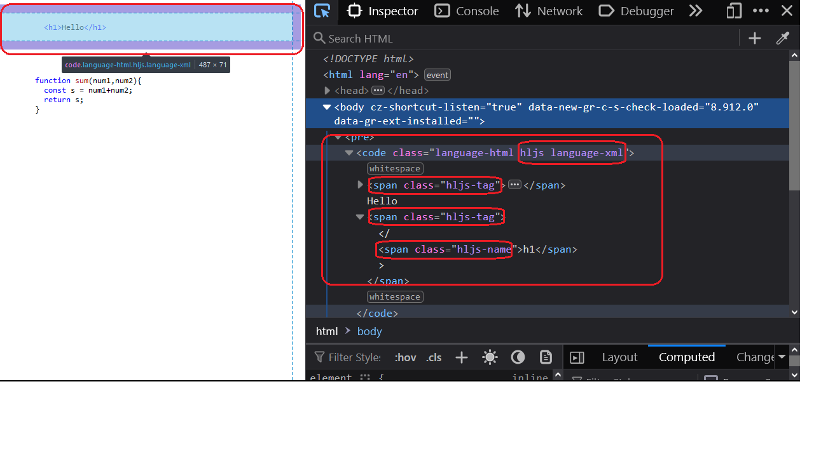
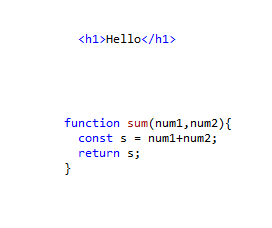

<h2>Motivation</h2>
Experiment with highlight.js in the browser
 to use color as done e.g. in vs code 

<h2>Usage</h2>
Invoke index.html

<h2>Instalaltion</h2>
None , cdn are all ready used in index.html

<h2>Ingredients of highlight.js</h2>
Add the following to your html file. replace /path with the current path. In index.html i have used path to cdn and replaced the default css with vs (code) css. There are three ingridents

<ul>
<li>
highlight.js css file

```
<link rel="stylesheet" href="/path/to/styles/default.min.css">
```

</li>
<li>
highlight.js js file

```
<script src="/path/to/highlight.min.js"></script>
```

</li>
<li>
highlight.js js function

```
<script>hljs.highlightAll()</script>
```

</li>

</ul>


<h2>Basic idea</h2>
<ul>
<li>wrap the part that you dont want the browser to interpret with pre and code eleemnt</li>
<li>add to the code element a class that start with language e.g. language-html that will be idenetify by hljs.highlightAll() which will add elements and classes that will be style according the the gihjight css file - vs.min.css in this example. check this figure



</li>
</ul>


<h2>HTML</h2>
add html that you want the browser to interprert as code element ( notice that you need to replace <,> with &lt; , &gt; respectively)

```
<pre><code class="language-html">
          &lt;h1&gt;Hello&lt;/h1&gt;;
</code></pre>
```

<h2>Javascript</h2>

add javascript that you want the browser interprert as code element

```
<pre><code class="language-javascript">
        function sum(num1,num2){
          const s = num1+num2; 
          return s;
        }
</code></pre>
```

</li>
</ul>


<h2>Result html</h2>


