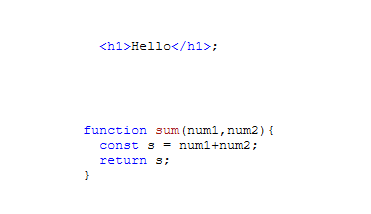

<h2>Motivation</h2>
Experiment with highlight.js

<h2>Browser usage</h2>
<ul>
<li>
Add the following to your html file. replace /path with the current path. In index.html i have used path to cdn and replaced the default css with vs (code) css

```
<link rel="stylesheet" href="/path/to/styles/default.min.css">
<script src="/path/to/highlight.min.js"></script>
<script>hljs.highlightAll()</script>
````

</li>
<li>add html code as follows ( notice that you need to replace <,> with &lt; , &gt; respectively)

```
<pre><code class="language-html">
          &lt;h1&gt;Hello&lt;/h1&gt;;
</code></pre>
````

</li>
<li>add javascript code as follows 

```
<pre><code class="language-javascript">
        function sum(num1,num2){
          const s = num1+num2; 
          return s;
        }
</code></pre>
````

</li>
</ul>

<h2>Points of interest</h2>
<ul>
<li>One will get the same results removing the class language-javascript \ language-html</li>
</ul>


<h2>Result</h2>


